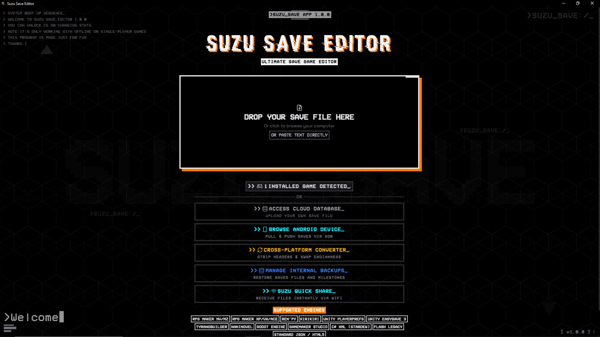
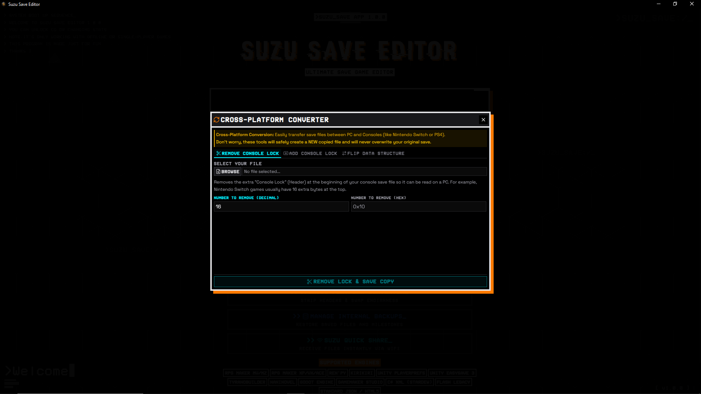
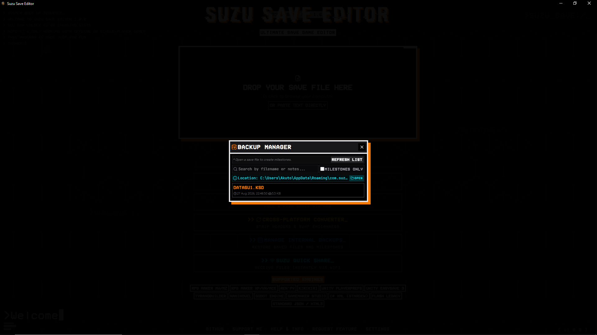
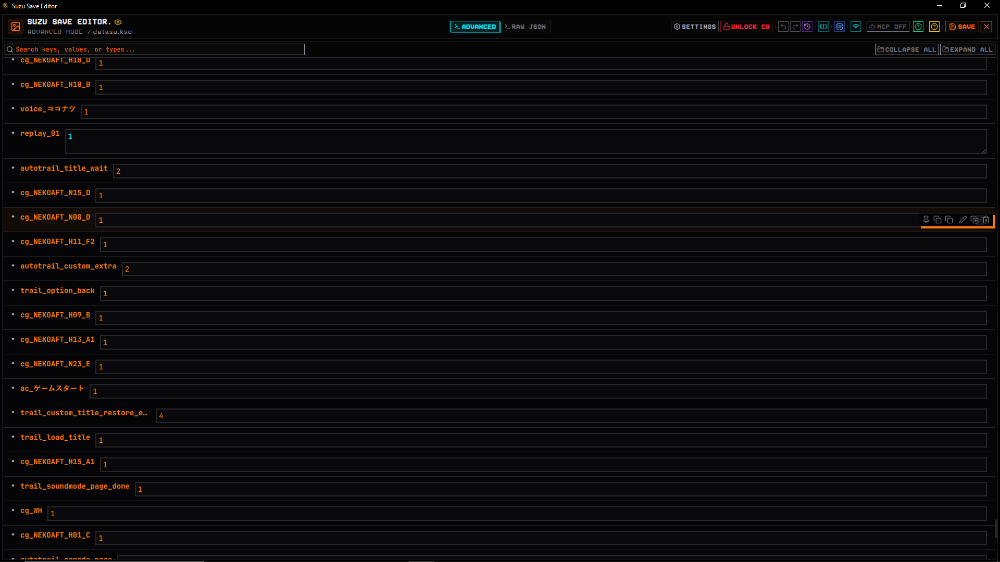
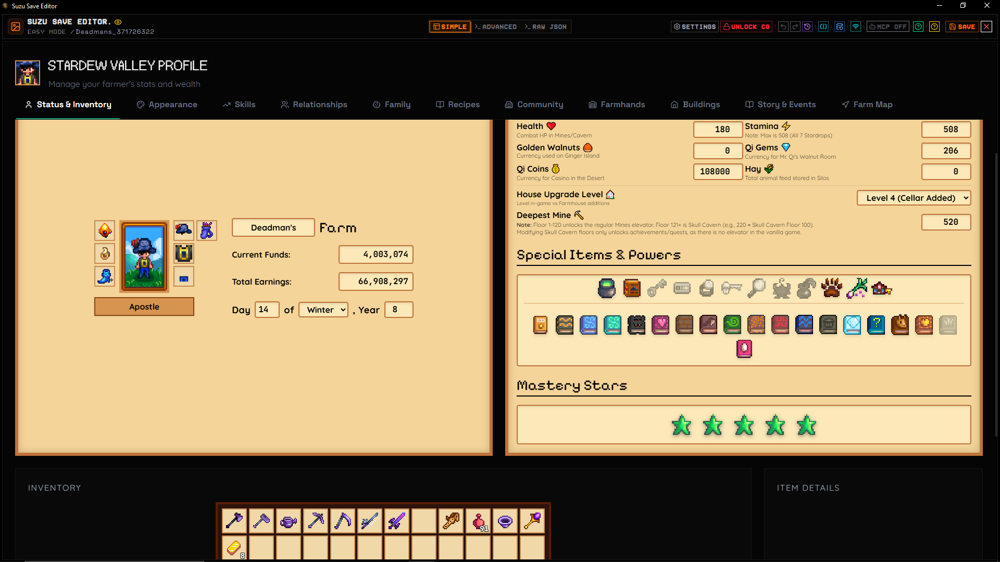
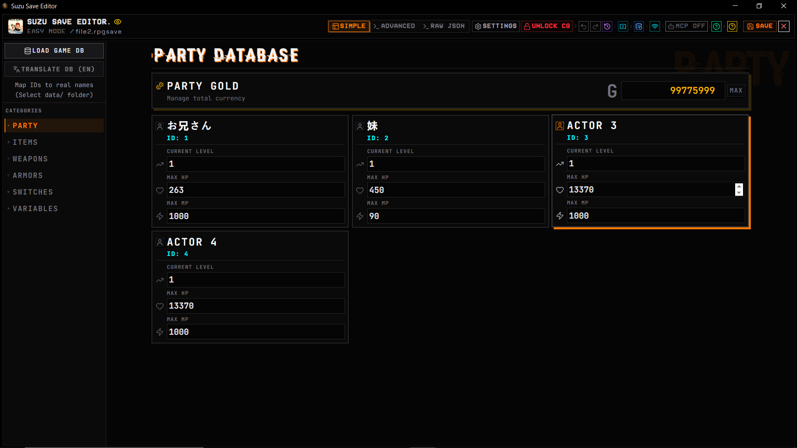
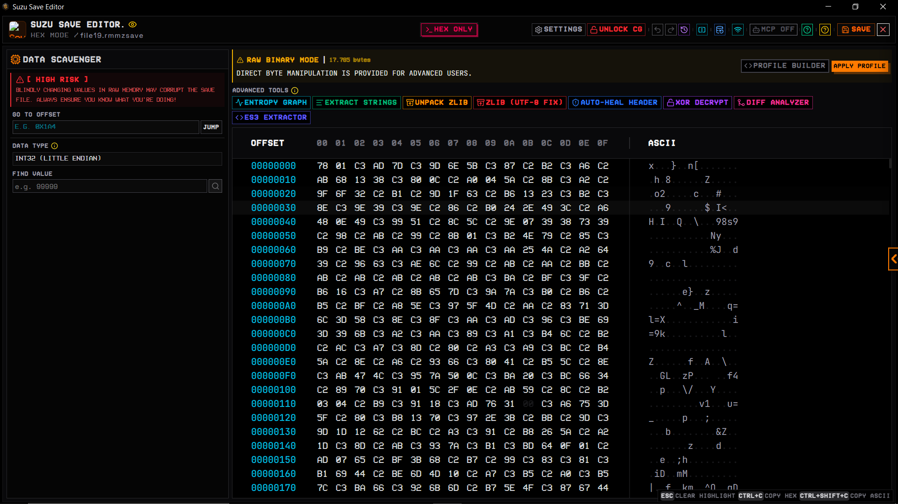

So it's basically <b> Totally Free, Open Source and Offline Save Editor </b> mainly for RPG and some Visual Novel Games especially for JSON typa save file. For more info, below here's some yapp from AI. I'm too lazy making some yapp dictionary, further thing better discover yourself. Thanks again for using this program:)
<details>
  <summary><b>Detail Information</b></summary>
<div align="center">
  <h1>Suzu Save Editor</h1>
  
  <p>
    
    
    
    
    
    
  </p>

  
</div>

## Overview

**Suzu Save Editor** is the Ultimate Save Game Manager & Editor designed for modders and power users. Built from the ground up to be blazingly fast, highly secure, and exceptionally lightweight, this highly-optimized application provides an unparalleled save editing experience.

Whether you're tweaking stats, exploring raw Hex data, or seamlessly moving your saves across devices, Suzu Save Editor handles it effortlessly across Windows, Linux, and Android.

## Key Features

| Feature | Description |
|---|---|
| **Quick Share LAN** | Instantly send and receive save files across your local WiFi using a secure 4-digit PIN and QR code pairing. |
| **Auto-Backup & Manager** | Safeguard your progress. Manage internal backups, restore previous milestones, and use the **Semantic Visual Diff** to compare save states. |
| **Android Device Browser** | Connect via ADB to browse, pull, and directly edit save files from your Android phone without manual copying. |
| **Model Context Protocol (MCP)** | Embeds a local background server allowing external AI agents (like Claude Desktop or Cursor) to read, analyze, and safely patch your live memory state using 20+ specialized tools. |
| **Interactive Hex & JSON Editors** | Dive deep with Virtualized Tree-View editors, inline hex editing, multi-type memory scanning, and a built-in search engine with dictionary badging. Features include Variable Pinning, inline key renaming, and automatic UI optimization for large Base64 image data. |
| **Diff Profiles & Memory Mapping** | Compare two different save files side-by-side to isolate changing bytes, then build and share custom memory maps. |
| **Advanced Reverse Engineering** | Calculate file entropy, extract filtered ASCII strings, unpack Zlib payloads (with auto-fix for UTF-8 corrupted streams), perform XOR decryption (with Auto-Guess Frequency Analysis), extract Unity ES3 AES passwords from DLLs, and auto-heal magic headers directly in the editor. |
| **Cloud Database** | Access a global repository to upload, share, and bulk-download save files, complete with auto-metadata scraping (VNDB/Steam/Bangumi). |
| **Smart Extractor & Security** | Built-in anti-malware payload filter for uploads, and automatic ZIP collision detection to safely extract downloaded saves. |
| **Cross-Platform Converter** | Convert saves between PC and Consoles (Switch/PS4/Wii) by removing/injecting headers (Console Locks) and flipping Endian byte structures. |
| **Flag & Profile Injector** | Auto-inject custom flags and properties using community-driven JSON profiles or Direct Folder modes. |
| **Visual Novel CG Unlocker** | Easily bypass gallery restrictions by automatically scanning game folders to extract internal flags or by downloading community-curated unlock profiles. Features Bulk Export, CSV key importing, advanced key modifiers (prefix/suffix/casing), a dedicated Profile Builder to create custom unlock profiles, and a Raw JSON Editor. |
| **Fail-Safe Save System** | Prevents accidental save corruption using a 'Hold-to-Confirm' mechanism and auto-creates backups before saving. |
| **Direct String Parsing** | Instantly load your game data by dragging & dropping save files or directly pasting raw JSON/Base64 strings. |
| **Smart RAM Management & Lite Mode** | Auto-detects massive save files (2MB+) and dynamically disables IDE features (minimap/folding) to prevent RAM crashes on low-end PCs. |
| **Auto-Detect Games** | Automatically scans your registry for installed games and locates their save files for 1-click editing. |
| **Auto-Translator DB** | Built-in RPG Maker database translator. Instantly translates foreign items, weapons, and variables to English. |
| **Stardew Valley Engine** | Dedicated dashboard featuring an interactive Farm Layout Visualizer, Animal/Building Spawners, and comprehensive inventory/relationship managers. |
| **Time Machine History** | A visual timeline tracking exact actions and paths with full Undo (Past) and Redo (Future) support. |
| **Lazy Loading & ErrorBoundary** | Enjoy a buttery-smooth UI that dynamically loads heavy components and safely catches crashes if a file is corrupted. |

## Modding & Custom Parsers

Want to build your own save file parsers for unsupported games? Suzu Save Editor provides a powerful Plugin Engine that allows you to easily create custom decoders/encoders! 

We support plugins written in **Lua**, **WebAssembly (Extism)**, and **Kaitai Struct**.
Check out our official **[Modder Guide](docs/modding/README.md)** to get started on building your first plugin!

## Backend Architecture & Features (Rust)

The core engine of Suzu Save Editor is written in Rust (`src-tauri/src`), providing native performance, memory safety, and extensive system-level capabilities.

### Core Modules

| Module / Feature | Description |
|---|---|
| **Game Engine Parsers** | Modular system supporting 20+ engines (RPG Maker, Ren'Py, Unity, Godot, WOLF RPG, Kirikiri, Stardew Valley, Unreal Engine, TyranoBuilder, etc.) and dynamic plugins. |
| **Reverse Engineering Tools** | Built-in tools for binary pattern scanning, entropy calculation, string extraction, XOR decryption, and Zlib/Gzip decompression. |
| **Secure File Ops & Checksums** | Protected ZIP extraction (anti-Zip Bomb) and a robust checksum engine (CRC-16, SUM/XOR-8) to validate save integrity. |
| **ADB Integration** | Built-in Android Debug Bridge commands to manage connected devices, browse directories, and push/pull files directly. |
| **Backup Manager** | Dedicated subsystem that automatically snapshots and tracks your save files locally before any data mutation occurs. |
| **Cross-Platform Converter** | Tools for converting save files between different platforms, handling endianness swapping and header manipulation. |
| **Storage Access Framework** | Native Android SAF integration for secure and scoped file storage access on modern Android versions. |

### Architectural Highlights

**Mini Web Server (Axum & MCP)**
An embedded Axum web server runs persistently in the background to provide HTTP and SSE (Server-Sent Events) endpoints. This powers the **Model Context Protocol (MCP)** bridge and the Quick Share LAN functionality, enabling seamless local network communication without external dependencies.

**Android Native Kotlin Bridge (Shizuku & SAF)**
The Tauri `gen/android` project contains custom native Kotlin implementations (`ShizukuAPI.kt`, `SafAPI.kt`) that communicate directly with the Rust backend via custom JNI bindings. This deep native integration enables:
- **Rootless Modding via Shizuku:** Interfacing with the Shizuku API to bypass Android 11+ scoped storage restrictions, allowing direct read/write access to game saves in `Android/data` without requiring a rooted device.
- **Storage Access Framework (SAF):** Native Android intent execution and URI content resolver integration for robust file handling.
- **SU Fallbacks:** Standard Superuser fallbacks for traditional rooted devices.

**AI Mutation Hooks**
Deep integration for injecting AI-generated payload modifications directly into the application's active memory state (`apply_ai_mutation`), enabling automated and intelligent save file editing.

## Tech Stack

Built with a robust, modern, and high-performance stack:

- **Frontend Core:** SolidJS, Vite, Tailwind CSS v4
- **App Framework:** Tauri v2
- **Backend & Systems:** Rust, Axum
- **Database & Auth:** Supabase
- **Editor Engine:** Monaco Editor

## Installation & Build Guide

### Prerequisites
Before compiling the project, ensure you have the following installed:
- [Node.js](https://nodejs.org/) (v18 or higher)
- [Rust Toolchain](https://rustup.rs/) (`cargo`, `rustc`)
- Platform-specific build tools for Tauri (e.g., MSVC on Windows, WebKit dependencies on Linux).

### Desktop Development & Compilation

To run the application locally in development mode (with Hot-Module Replacement):
```bash
npm install
npm run tauri dev
```

To build the final, optimized release executable for your desktop platform (Windows/Linux):
```bash
npm run tauri build
```

### Android Build Guide

Building for Android requires the Android Studio SDK and NDK to be properly configured.

1. Ensure the `ANDROID_HOME` and `NDK_HOME` environment variables are correctly set.
2. To run the app on a connected Android device or emulator for testing:
   ```bash
   npm run tauri android dev
   ```
3. To build the release APK:
   ```bash
   npm run tauri android build
   ```

**Android Keystore Warning:** If you are building the Android APK, you **must** set up a local Keystore to sign the release APK. This is crucial because `cleartextTraffic` is enabled to facilitate the local WiFi Quick Share LAN feature. Ensure your Android build environment is correctly configured with your Keystore credentials before compiling.

### CI/CD Integration

This project utilizes **GitHub Actions** for continuous integration and deployment. The pipeline is configured to automatically build the Windows executable (`.exe`) and generate the `latest.json` file. This securely powers the built-in Auto-Updater, ensuring users always have the latest, most optimized version without manual downloads.

## License
This project is licensed under the **GNU General Public License v3.0 (GPL-3.0)**. 
See the `LICENSE` file for more details. 
By contributing, you agree to release your code under this same license.

## Disclaimer

**Use at your own risk.** Modifying game save files can lead to unintended consequences, including but not limited to corrupted data, broken game progression, or account bans (especially in games with online components or anti-cheat systems). The developer(s) of Suzu Save Editor hold **no responsibility** for any damage, data loss, or punitive actions taken against you resulting from the use of this tool. Always back up your original save files!
</details>

<details>
  <summary><b>Program Preview Image</b></summary>

<div align="center">

</div>
<div height="30px"></div>
<div align="center">

</div>
<div height="30px"></div>
<div align="center">

</div>
<div height="30px"></div>
<div align="center">

</div>
<div height="30px"></div>
<div align="center">

</div>
<div height="30px"></div>
<div align="center">

</div>
<div height="30px"></div>
<div align="center">

</div>
<div height="30px"></div>
<div align="center">

</div>
<div height="30px"></div>
<div align="center">
<p><b> I'm too lazy to take a screenshot, so feel free to explore it yourself for more. Thanks:) </b></p>
</div>
</details>